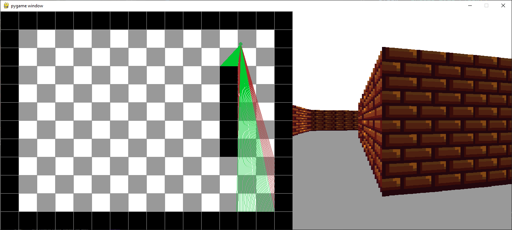

## Ray Casting 2D to 3D

(This is a simple program I made for fun during my first year as a student. My most recent project is the YouTube Downloader.)

This is a ray-casting program that casts an array of rays in a 2D map and draws rectangles of varying sizes according to the length of the ray in order to display a 3D room.

One side of the program shows a representation of what the program "sees," while the other side displays the result.

This program allows you to turn right and left using the arrow keys, as well as move in all directions with the WASD keys. You can add blocks to the grid by right-clicking and remove blocks by left-clicking.

The different colors of the rays indicate which side of the block they are hitting. The program uses this information to darken one side and create the illusion of light and shadow, making the corners more visible.